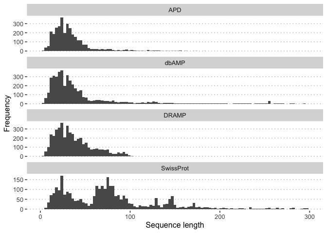
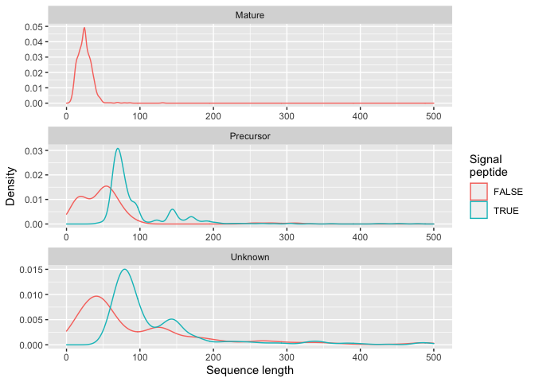
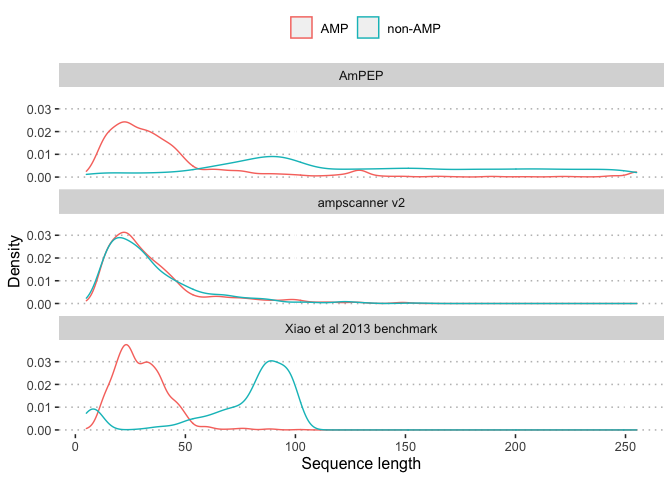

Databases used for testing and training ampir
================

## Public AMP databases

The following databases were accessed as of March 2020. All `ampir`
models were trained using data from one or more of these databases (see
details below).

Four recently updated antimicrobial peptide (AMP) databases were used:

  - [APD 3](http://aps.unmc.edu/AP/) by [Wang et
    al. 2016](https://academic.oup.com/nar/article/44/D1/D1087/2503090)
  - [DRAMP 2.0](http://dramp.cpu-bioinfor.org/) by [Kang et
    al. 2019](https://www.ncbi.nlm.nih.gov/pubmed/31409791).
  - [dbAMP](http://140.138.77.240/~dbamp/index.php) by [Jhong et
    al. 2018](https://www.ncbi.nlm.nih.gov/pubmed/30380085)
  - [UniProt](https://www.uniprot.org/uniprot/?query=keyword%3A%22Antimicrobial+%5BKW-0929%5D%22&sort=score)
    using the keyword “Antimicrobial \[KW-0929\]”.

Raw downloads for these databases are included in the data distribution.
After unpacking they should be present at the following file
locations:

| Database Name | File                                                                    |
| ------------- | ----------------------------------------------------------------------- |
| APD 3         | `raw_data/amp_databases/APD_032020.xlsx`                                |
| DRAMP Natural | `raw_data/amp_databases/dramp_nat_tidy.fasta`                           |
| dbAMP         | `raw_data/amp_databases/dbAMPv1.4.xlsx`                                 |
| UniProt       | `raw_data/amp_databases/uniprot-keyword__Antimicrobial+[KW-0929]_.xlsx` |

### APD

The [Antimicrobial Peptide Database](http://aps.unmc.edu/AP/main.php)
appears to be regularly updated and contained 3177 AMPs in March 2020.
An outdated (2017) AMP sequence list is downloadable from
<http://aps.unmc.edu/AP/downloads.php> which currently contains 2,338
sequences. To include the updated AMP list, the [web query
interface](http://aps.unmc.edu/AP/database/query_input.php) was used to
obtain the full 3,177 AMPs along with sufficient metadata to filter
unwanted entries.

### DRAMP

[DRAMP’s download page](http://dramp.cpu-bioinfor.org/downloads/)
provides access to a general AMP dataset (which contains both natural
and synthetic AMPs). This general dataset was posted on 06/08/2019 but
according to the “news and events” section, the [natural
dataset](http://dramp.cpu-bioinfor.org/browse/NaturalData.php) has been
updated several times since then. Because the natural dataset contains
the AMPs we are interested in and is also more regularly updated (it
currently contains 4394 sequences), the natural AMP data was obtained
using a [scrape script](scripts/scrape_dramp.sh).

### dbAMP

The latest release of dbAMP is from 06/2019 and was downloaded from
their [download page](http://140.138.77.240/~dbamp/download.php). It
contains 4213 experimentally verified natural AMPs (synthetic AMPs were
removed).

### UniProt

AMPs were downloaded from UniProt on 14-April-2020 using the search
term: “keyword:Antimicrobial \[KW-0929\]”. This included 3221 reviewed
and 19288 unreviewed proteins.

## Summary of AMP databases

One of the most striking differences between AMP databases becomes clear
simply by looking at the length distributions. The `APD` and `DRAMP`
databases emphasise short peptides (mostly \< 50 amino acids) which
reflects their focus on mature peptides rather than full length
precursor proteins.

<!-- -->

The SwissProt database provides a `Peptide` field which allows us to
distinguish between entries for mature peptides and precursors. If the
Peptide length is the same as the total length, it is a mature peptide.
For entries where such information is available we see a very clear
split with mature peptides having a typical length of 25 amino acids
(AA) whereas precursors are slightly longer at around 60-75 AA. Note
that the length distribution of mature peptides matches the APD length
distribution very well but all other databases, including dbAMP include
longer sequences and therefore are likely to include some fraction of
precursors. Note that there are a total of 768 mature peptides, 806
precursors with peptide annotation information, and 1647 reviewed AMPs
without Peptide information. The `Unknown` category has a notably
broader distribution of lengths reflecting the possibility that it
includes a mix of both
types.

<!-- -->

Another indicator that a protein is an AMP precursor is the presence of
a signal peptide. 706 of the 806 precursors identified above have well
defined signal peptide sequences. The length distribution plot below
shows that only precursors longer than about 60 AA are likely to have a
signal peptide. Manual inspection of precursors without signal peptides
revealed that many are annotated with a pro-peptide indicating that even
in this group there is some post-translational processing to produce a
mature
product.

<!-- -->

SwissProt also includes a small number of larger proteins (\>500 AA)
that are listed under the keyword Antimicrobial but are very different
from classical AMPs. These include some large viral proteins (e.g.
[EXLYS\_BPDPK](https://www.uniprot.org/uniprot/Q8SCY1)) which show
evidence of antibacterial activity but their mode of action and vast
difference in size make them outliers from the point of view of building
a machine learning model.

### Other peptide datasets

**AmPEP Training Data**

The AmPEP AMP predictor provides its training data available directly
for download. The length distribution of sequences in this database is
interesting. It shows that sequences classified as AMPs form a clear
peak corresponding to mature peptides whereas non-AMP (background)
sequences are clearly larger and more likely to represent full length
proteins.

**AMP Scanner v2 Data**

AMP Scanner data used for training, testing and evaluation are available
directly for download from
<https://www.dveltri.com/ascan/v2/about.html>. In contrast with the
AmPEP data the lengths of positive and negative datasets are much more
closely matched for AMPScanv2. This reflects specific steps taken by the
authors of AMP scanner v2 (detailed in [Veltri et
al. 2018](https://doi.org/10.1093/bioinformatics/bty179%5D)) to extract
random sub-sequences from non-AMPs that have a matching length
distribution to the AMPs themselves.

**Xiao et al. Benchmark data**

The benchmark data provided by Xiao et al. 2013 has been used in several
studies to provide a somewhat independent estimate of prediction
accuracy. Although this data is restricted to sequences less than 100 AA
it otherwise resembles the AmPEP data in overall length distribution.
This helps explain the extraordinary accuracy of AmPEP when tested with
this benchmark. A more worrying issue is that this benchmark, and the
AmPEP training data, have length distributions which suggest that
positive cases are mature peptides while negative cases are full length
proteins. A predictor optimised to perform well on such data will
therefore be effective at distinguishing mature peptides from precursor
proteins but perhaps not so effective at distinguishing between AMP and
non-AMP mature peptides (arguably a more important and interesting
task). We would therefore recommend that future work use a negative
dataset that is as close as possible to a set of non-AMP mature
peptides. Since this is difficult to obtain, the negative data should at
least have a similar length distribution to the positive dataset
(i.e. reflecting other types of mature
peptides).

<!-- -->

## Database used for the `ampir` default (precursor) model

Since our goal with `ampir` is to obtain the maximum possible utility
for genome-wide scans, we sought to build a positive AMP dataset
consisting entirely of precursor proteins. In typical genome-scanning
operations this is the only information available.

To achieve this we used the following criteria to design our database:

Firstly we start with the UniProt database and only include proteins if
they are present in either the reviewed or unreviewed elements of this
database. Although this removes a small number of proteins from custom
AMP databases it allows us to make use of extensive metadata included
for all proteins in UniProt. The following filters are then applied:

1.  Exclude all mature peptides
2.  Exclude unreviewed proteins unless they also appear in APD, DRAMP or
    dbAMP
3.  Remove proteins with lengths \< 50 AA since these might be mature
    peptides included in APD, DRAMP or dbAMP
4.  Remove very large proteins (\>500 AA) since these are likely to have
    very different physicochemical properties and are not amenable to
    prediction by this method
5.  Remove identical sequences
6.  Remove sequences with nonstandard amino acids

This leaves an initial database with 2061 entries, of which 61 are
unreviewed.

``` bash
cd-hit -i raw_data/amp_databases/ampir_positive.fasta -o raw_data/amp_databases/ampir_positive90.fasta -c 0.90 -g 1
```

As a final step we write the database to a FASTA file and then use
`cd-hit` to cluster sequences to 90% identity, keeping only a single
representative sequence for each cluster. This reduces the database size
(to 1483 sequences) but roughly maintains the same length distribution.

Certain organisms are particularly well annotated for AMPs. We find that
our final database contains a large number of *Arabidopsis*, human,
mouse, chicken and rat sequences.

| Organism                               | nentries | n90\_entries |
| :------------------------------------- | -------: | -----------: |
| Arabidopsis thaliana (Mouse-ear cress) |      289 |          282 |
| Mus musculus (Mouse)                   |       96 |           77 |
| Homo sapiens (Human)                   |       84 |           61 |
| Rattus norvegicus (Rat)                |       59 |           52 |
| Bos taurus (Bovine)                    |       43 |           34 |
| Gallus gallus (Chicken)                |       23 |           19 |

### Database files

  - Full database (prior to `cd-hit` clustering) along with SwissProt
    metadata is available at `raw_data/amp_databases/ampir_db.tsv`
  - A FASTA formatted file with 90% clustered sequences
    `raw_data/amp_databases/ampir_positive90.fasta`

## `ampir` mature-peptide model

Another approach to AMP prediction is to focus entirely on mature
peptides as these are the most likely to have shared/convergent
physicochemical properties since they are the active molecules.

For this approach we build a database as follows:

1.  Include all AMPs from the APD, DRAMP and dbAMP databases with
    lengths \>10 AA and \< 60 AA
2.  Include mature peptides from SwissProt (also with length \>10 AA and
    \<60 AA)
3.  Remove sequences that are identical or that contain non-standard
    amino acids

The resulting database has a high proportion of peptides

Finally cluster these sequences to 90% identity with
`cd-hit`

``` bash
cd-hit -i raw_data/amp_databases/ampir_mature_positive.fasta -o raw_data/amp_databases/ampir_mature_positive90.fasta -c 0.90 -g 1
```

### Database files

  - Full database (prior to `cd-hit` clustering) along with SwissProt
    metadata is available at
    `raw_data/amp_databases/ampir_mature_positive.fasta`
  - A FASTA formatted file with 90% clustered sequences
    `raw_data/amp_databases/ampir_mature_positive90.fasta`
