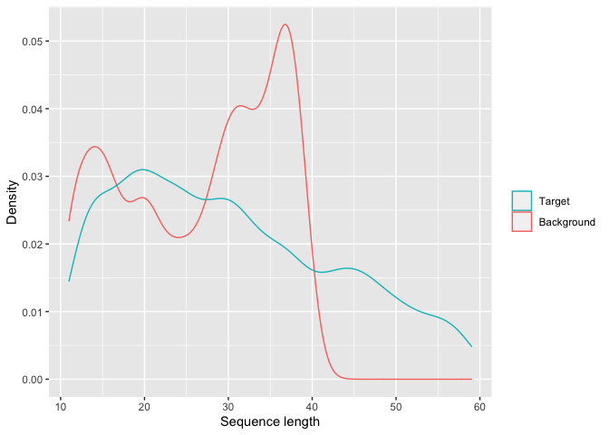

Build a training dataset for `ampir`
================

Since `ampir` uses supervised learning to create a classifier it needs a
training set consisting of confirmed “positive” AMP (or precursor)
sequences and also a background (or “negative”) dataset consisting of
non-AMP sequences. Construction of these training data is a critical
step and has an enormous effect on the performance of the predictor. In
[01_collate_databases](01_collate_databases.md) the process of positive
dataset construction is decribed. Here we describe how the background
data and overall training sets are built.

## Precursor Background Dataset

As our basis for a background dataset we use all reviewed proteins in
the UniProt database. Our goal is to use fairly minimal filtering on
these so that they have roughly the same composition as a typical set of
non-AMP proteins in a genome. The filtering is as follows:

1.  Use `cd-hit` to cluster sequences to 90% identity
2.  Remove any sequences in the UniProt AMP dataset
3.  Check that no sequences in the background dataset contain
    non-standard amino acids.
4.  Remove sequences with AMP-like lengths 50 AA, and very large lengths
    (\>500 AA)
5.  Randomly sample the background data so that AMP:non-AMP ratio is
    1:10

**Step 1** is computationally intensive and was performed using `cd-hit`
using SwissProt data downloaded on 7 April 2020. The resulting clustered
file is included in the data distribution as
`uniprot-filtered-reviewed_yes_90.fasta`

``` bash
cd-hit -i uniprot-filtered-reviewed_yes.fasta -o uniprot-filtered-reviewed_yes_90.fasta -c 0.90 -g 1 -T 32 -M 300000
```

**Step 2** To exclude any potential AMPs from this dataset we use the
unix `comm` command to create a list of all SwissProt identifiers in the
clustered SwissProt data that are not present in the UniProt AMP
database. To avoid the computational load of using the entire dataset,
this is then piped to another unix command `shuf` which takes a random
subset of the identifiers and this is finally piped to `samtools faidx`
which extracts the relevant FASTA entries and writes them to a file.

At this stage we keep more background proteins than needed for a
balanced dataset. This is for several reasons. Firstly a small number of
background proteins might be removed under additional filtering
criteria. Secondly we may choose to use an unbalanced dataset in order
to achieve better overall performance on whole genome scans.

``` bash
comm -23 \
  <(cat uniprot-filtered-reviewed_yes_90.fasta | bioawk -c fastx '{print $name}' | sort) \
  <(cat amp_databases/uniprot-keyword__Antimicrobial+\[KW-0929\]_.fasta | bioawk -c fastx '{print $name}' | sort) | \
  shuf -n 50000 | \
  xargs samtools faidx uniprot-filtered-reviewed_yes_90.fasta > amp_databases/ampir_negative90.fasta
```

**Steps 3, 4 and 5** are fairly trivial. Length filters are applied and
sequences with non-standard AAs removed

**Also create a negative dataset which has equal amount of sequences to
the positive dataset, to train a balanced model**

## Mature Peptide Background Dataset

As a background dataset for mature peptides the ideal would be to take
mature peptides from SwissProt that are not AMPs. We could use the
Peptide field to find instances which correspond to mature peptides but
there are very few such peptides verified and they tend to be
neuropeptides and toxins. A broader range of small peptides can be
obtained simply by using a size range filter on the SwissProt data:

1.  Use non-AMP sequences clustered to 90% identity from SwissProt as a
    starting point
2.  Keep only sequences \>10 AA and \<40 AA
3.  Remove non-standard amino acids

``` bash
comm -23 \
  <(cat uniprot-filtered-reviewed_yes_90.fasta | bioawk -c fastx '{print $name}' | sort) \
  <(cat amp_databases/uniprot-keyword__Antimicrobial+\[KW-0929\]_.fasta | bioawk -c fastx '{print $name}' | sort) | \
  xargs samtools faidx uniprot-filtered-reviewed_yes_90.fasta |\
  bioawk -c fastx 'length($seq)<40{printf(">%s\n%s\n",$name,$seq)}' \
  > amp_databases/ampir_mature_negative90.fasta
```

Examination of the length distributions reveals a slightly larger
proportion of short peptides in the background data compared with the
target (positive) data. Since there are relatively few mature peptides
of this type available in SwissProt this could reflect acquisition bias
towards peptides of academic or industrial interest such as
neuropeptides. As SwissProt grows to become more representative it
should be possible to improve both positive and negative datasets here.

<!-- -->

## Legacy Background Dataset

For comparison with previous approaches we built a background dataset
with a similar composition to AmPEP and iAMPPred predictors. It contains
mature AMPs as the positive dataset but includes some full length
proteins in the background data.

1.  Use non-AMP sequences clustered to 90% identity from SwissProt as a
    starting point
2.  Keep only sequences \>20 AA and \<100 AA
3.  Remove sequences with non-standard amino acids
4.  Sample this dataset randomly so that it is balanced (same number of
    peptides as the positive data)

## Training and Test Sets

Using the target and background proteins identified above we create
paired training and test sets. In all cases we use 80% of data for
training and reserve 20% for testing. These datasets are saved to cache
and used for model training and tuning scripts. The training sets
created are:

1.  Precursor training (balanced mix of target and background
    precursors)
2.  Mature peptide training
3.  Precursor training but with Human and *Arabidopsis* sequences
    removed (for benchmarking purposes)

## Benchmarking Data

For the precursor model we evaluate its performance using whole genome
scans based on the Human proteome (UniProt: `UP000005640`) and
*Arabidopsis* proteome (UniProt: `UP000006548`). For model evaluation
purposes only we generate training data where proteins from either of
these databases are removed.

For each model we evaluate its performance using the 20% of training
data that was held out for model evaluation.
