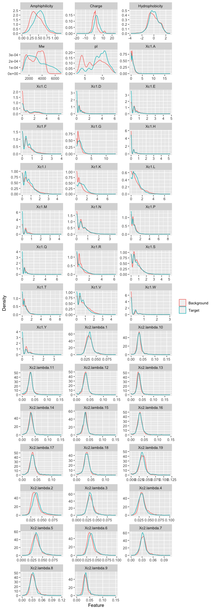
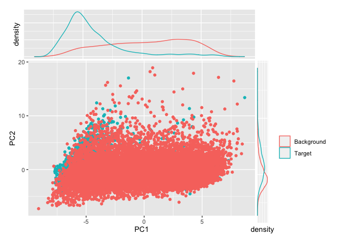

Feature selection
================

As an indication of features that are likely to be useful for
classification we plot their distributions for background and target.
Also note that these feature distributions are sometimes heavily
influenced by background filtering. In the plot below we see that all
distributions are relatively well-behaved and should be amenable to
centering and scaling. This is at least partly because our large protein
cut-off of (500 AA) removes a small number of very large proteins that
cause skew in the Mw and Charge distributions. Also notable is the fact
that higher order lamba values from the Pseudo-amino acid composition
seem to show little difference between target and background (this is
not true of low order values though).

<!-- -->

### PCA

PCA suggests that these predictors have some (but imperfect) power to
separate the two classes. This gives an indication of how well models
will perform in general but does not capture the capabilities of
supervised learning methods like SVM.

<!-- -->

## Correlated Predictors

Although a small number these predictors are correlated there are none
with near-perfect correlation (max cor \< 0.9). We therefore did not
remove any features on the basis of correlation since this is unlikely
to negatively affect model performance.

    ##     Min.  1st Qu.   Median     Mean  3rd Qu.     Max. 
    ## -0.49066 -0.07784  0.11654  0.16758  0.35732  0.87584

## Recursive feature elimination (RFE)

RFE analysis in principle can be used to find an optimal subset of the
features to be included in the model. In practice we used this as a
guide only. Since this is a computationally intensive process it was
performed using the `rfe.R` and `rfe.sh` scripts on an HPC system. The
resulting `rfe` outputs suggest that the best performance can be
obtained with 20-30 predictors.

The set of features identified as optimal by RFE includes all bulk
physicochemical properties as well as most simple amino acid composition
measures. Higher order pseudoamino-acid composition measures do not
appear to be important to model performance according to
    RFE.

<!-- -->

    ##  [1] "Amphiphilicity" "Charge"         "Hydrophobicity" "Mw"            
    ##  [5] "pI"             "Xc1.A"          "Xc1.C"          "Xc1.D"         
    ##  [9] "Xc1.E"          "Xc1.F"          "Xc1.G"          "Xc1.H"         
    ## [13] "Xc1.I"          "Xc1.K"          "Xc1.L"          "Xc1.M"         
    ## [17] "Xc1.N"          "Xc1.P"          "Xc1.Q"          "Xc1.R"         
    ## [21] "Xc1.S"          "Xc1.T"          "Xc1.V"          "Xc1.W"         
    ## [25] "Xc1.Y"
