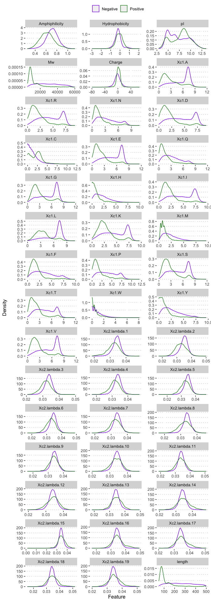

Feature selection
================

## Feature distributions

As an indication of features that are likely to be useful for
classification we plot their distributions for background and target.

``` r
features_tg_bg_1 <- read_rds("cache/features_1.rds")

features_bg_tg_1_long <- features_tg_bg_1 %>% gather(key = "Feature","Value",-seq_name,-Label)

ggplot(features_bg_tg_1_long,aes(x=Value)) + 
  geom_density(aes(color=Label)) + 
  facet_wrap(~Feature, scales = "free", ncol = 3)
```

<!-- -->

## Correlated Predictors

Although a small number these predictors are correlated there are none
with near-perfect correlation (max cor ~ 0.8). We therefore did not
remove any features on the basis of correlation since this is unlikely
to negatively affect model performance.

``` r
featuresCM <- cor(features_tg_bg_1[,-c(1,46)])
summary(featuresCM[upper.tri(featuresCM)])
```

    ##     Min.  1st Qu.   Median     Mean  3rd Qu.     Max. 
    ## -0.40262 -0.05128  0.12762  0.19889  0.35796  0.84302

## Recursive feature elimination (RFE)

RFE analysis was used to find an optimal subset of the features to be
included in the model. Since this is a computationally intensive process
it was performed using the `rfe.R` and `rfe.sh` scripts on an HPC
system. The resulting `rfe` outputs are provided in `cache/rfe_1.rds`
and show that the best performance can be obtained with 30 predictors.
The set of features also agrees with visual inspection of the feature
density plots as the selection includes those predictors that show clear
separation between target and background. This set of predictors was
used for subsequent model tuning and is encapsulated in the final model
included with the `ampir` package.

``` r
svmProfile <- readRDS("cache/rfe_1.rds")
trellis.par.set(caretTheme())
plot(svmProfile, type = c("g", "o"))
```

<!-- -->

``` r
predictors(svmProfile)
```

    ##  [1] "Amphiphilicity" "Charge"         "Hydrophobicity" "Mw"            
    ##  [5] "pI"             "Xc1.A"          "Xc1.C"          "Xc1.D"         
    ##  [9] "Xc1.E"          "Xc1.F"          "Xc1.G"          "Xc1.H"         
    ## [13] "Xc1.I"          "Xc1.K"          "Xc1.L"          "Xc1.M"         
    ## [17] "Xc1.N"          "Xc1.P"          "Xc1.Q"          "Xc1.R"         
    ## [21] "Xc1.S"          "Xc1.T"          "Xc1.V"          "Xc1.W"         
    ## [25] "Xc1.Y"          "Xc2.lambda.1"   "Xc2.lambda.10"  "Xc2.lambda.11" 
    ## [29] "Xc2.lambda.12"  "Xc2.lambda.13"

``` r
write_rds(predictors(svmProfile),"cache/predictors_1.rds")
```

``` r
model <- read_rds("cache/tuned.rds")
```
