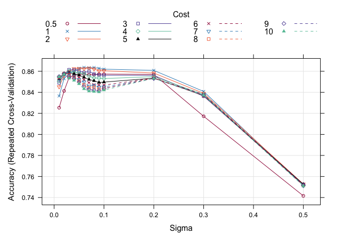
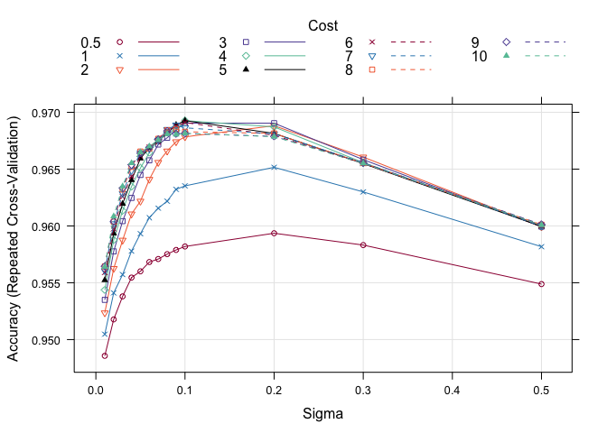

Model tuning
================

The default models included with ampir are both svms with radial kernel
and have two tuning parameters, sigma and C (cost). Optimal values for
these tuning parameters were obtained by using model tuning functions
available in `caret`. Since this is computationally intensive it was
performed on an HPC system. The R script `scripts/tune_model.R` provides
a convenient wrapper for the required functions and allows it to be run
easily on an HPC system. See the `scripts` directory for details of how
this was run.

Inspecting the results for the mature peptide model reveals the
variation of model performance with the tuning parameters.

<!-- -->

    ##    sigma C
    ## 18  0.02 6

And for the precursor model

<!-- -->

    ##     sigma C
    ## 104   0.1 4
