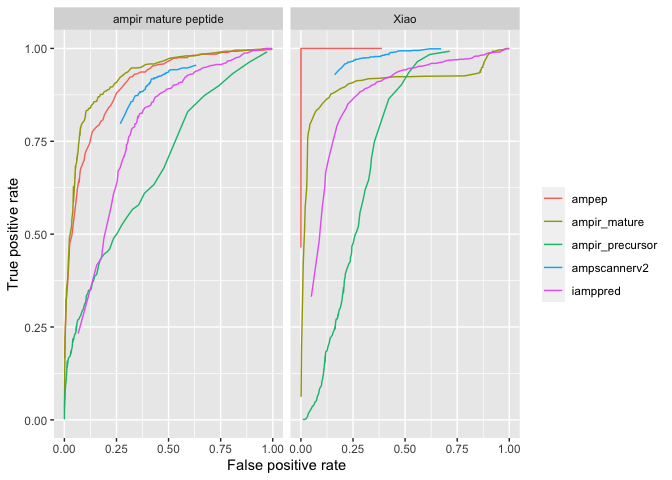
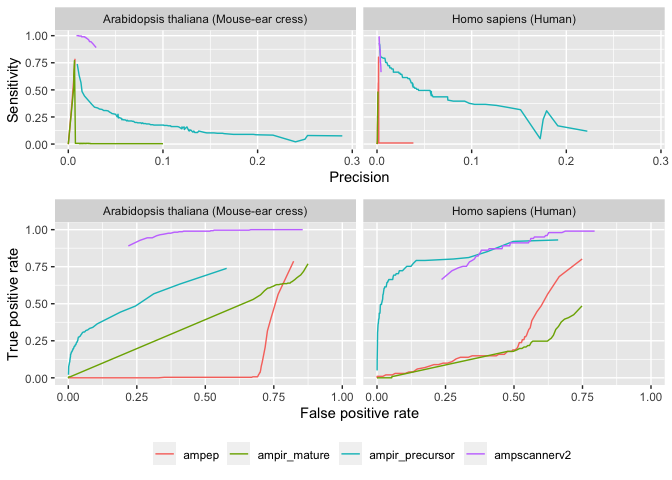
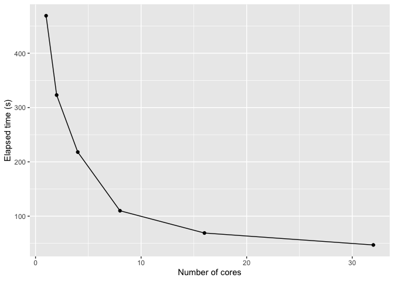

Benchmarking
================

When benchmarking the performance of AMP predictors a number of
important factors need to be considered:

1.  Any benchmark dataset will likely include some AMPs used for
    training in one or more of the predictors. Since most predictors are
    not open source they are provided as-is and it is almost impossible
    to devise a completely impartial benchmark based on AMPs that were
    not used to train any of the predictors.
2.  An existing benchmark dataset provided by [Xiao et
    al. 2013](https://doi.org/10.1016/j.ab.2013.01.019) has been
    adopted by several subsequent authors. The composition of this
    dataset is geared toward a mature peptide test because the positive
    cases are all mature peptides. The background dataset is perhaps not
    ideal to represent a background of mature (non-AMP) peptides because
    it has a length distribution suggesting that it contains a
    significant fraction of full length precursors.
3.  A realistic test of AMP prediction in genome-wide scans should use a
    benchmark dataset that is highly unbalanced, just as a real genome
    protein set would be. For example in the *Arabidopsis* genome AMPs
    make up less than 1% of proteins.  
4.  Real genomes contain non-AMP proteins that may resemble AMPs in some
    ways (e.g. secreted proteins, transmembrane proteins) and which will
    therefore make the classification problem more difficult. Any
    benchmark that does not include these proteins will most likely
    provide inflated estimates of accuracy.

In light of these issues we tested the performance of `ampir` against
contemporary AMP predictors using several benchmark datasets:

1.  The [Xiao et al. 2013](https://doi.org/10.1016/j.ab.2013.01.019)
    benchmark dataset. This was included in the interest of consistency
    with benchmarking from previous work but results from this benchmark
    are not likely to reflect real-world performance.
2.  A subset of the `ampir` mature peptide training data which we set
    aside for model evaluation and was not used in training. This
    dataset consists of known AMP mature peptides as positive cases and
    non-AMP mature peptides as negative cases. It should reflect
    real-world performance in situations where a researcher has access
    to a mature peptide sequence (e.g. by mass spectrometry) and wishes
    to determine if it is an AMP or another type of small peptide such
    as a toxin or neuropeptide.
3.  A whole-genome scanning benchmark for species with the best
    available annotated AMP repertoires. We chose an animal (Human) and
    a plant (*Arabidopsis thaliana*) for this test.

**Table 5.1:** AMP predictors with their papers and model
accessiblity

| AMP predictor name | Reference                                                           | Availability                                                                          |
| ------------------ | ------------------------------------------------------------------- | ------------------------------------------------------------------------------------- |
| AMP scanner v2     | [Veltri et al. 2018](https://doi.org/10.1093/bioinformatics/bty179) | [amp scanner webserver](https://www.dveltri.com/ascan/v2/ascan.html)                  |
| amPEP              | [Bhadra et al. 2018](https://doi.org/10.1038/s41598-018-19752-w)    | [MATLAB source code](https://sourceforge.net/projects/axpep/files/AmPEP_MATLAB_code/) |
| iAMPpred           | [Meher et al. 2017](https://doi.org/10.1038/srep42362)              | [iAMPpred webserver](http://cabgrid.res.in:8080/amppred/)                             |

AMP predictors were accessed in ***April 2020***

### Mature peptide benchmarks

Both the [Xiao et al. 2013](https://doi.org/10.1016/j.ab.2013.01.019)
benchmark and the `ampir` testing set are focussed on mature peptide
prediction (since mature peptides form the bulk of positive cases). The
benchmarks differ most substantially in the composition of their
background datasets. The Xiao et al. background data has a peak in
length distribution around 80-90 AA whereas for the `ampir` test set
this is more similar to the target set at around 40 AA.

The plot below shows performance of all predictors in the form of
receiver operating characteristic (ROC) curves. These show the tradeoff
between false positive rate and true positive rate (also called recall).
A few points to note from this plot:

  - The `ampir_mature` model performs well on both datasets whereas the
    `ampir_precursor` model performs very poorly. Users of `ampir`
    should therefore take care to always select the appropriate model
    for their task depending on the nature of the input data (mature
    peptides or precursor proteins).
  - Some predictors do not perform well at the extremes of the ROC
    curve. This reflects the ability of the predictor to produce
    accurate probability values across the full range of probabilities.
    In the case of `ampscanner v2` for example we see that its curve
    does not extend into the low false positive regime. This is because
    its probability distribution is strongly concentrated at the
    extremes (0 and 1), and a relatively large number of non-AMP
    peptides have been assigned a probability of 1.
  - The best performing predictors in the low false positive regime are
    `ampep` and `ampir_mature` in both datasets.

<!-- -->

**Figure 5.1:** Performance of a range of AMP predictors against two
mature peptide testing datasets.

### Real Genome Benchmark

Since we are building a model for the purpose of genome-wide prediction
a realistic test must involve data with composition similar to that of a
complete proteome.

One approach is to use whole genomes that have been well annotated for
AMPs. Here we chose the Human and *Arabidopsis* genomes because these
represent phylogenetically distinct lineages (animals and plants), and
their genomes are among the best annotated for AMPs. A few other points
to note about this test are:

  - We were able to run this test for `ampir`, `ampep` and `ampscanner
    v2` only because other predictors were unable to handle the large
    number of candidates sequences (~100k) in a practical manner.
  - We used a specially generated model for `ampir` that was trained
    without Human or *Arabidopsis* proteins to avoid any potential for
    inflated accuracy estimates in this test. It should be noted that
    other predictors would have no such restriction.
  - The actual number of true positives is probably an underestimate
    since our knowledge of the AMP repertoires of both species is
    incomplete.

<!-- -->

**Figure 5.2:** Performance of various AMP predictors in classifying
whole proteome data for Human and *Arabidopsis*. Performance is shown as
a balance of sensitivity and precision (top row) and as a ROC curve
(second row).

In Figure 5.2 (first row) we show how various predictors perform on
genome-scanning data as a tradeoff between sensitivity (proportion of
AMPs detected among all AMPs present in the dataset) and precision
(proportion of true positives compared with all positive results). This
shows that in order to obtain a high precision it is necessary to
discard many true AMPs (low sensitivity). Note that the
`ampir_precursor` model clearly outperforms all other models in this
context.

In Figure 5.2 (second row) we show ROC curves for all predictors on the
Human and *Arabidopsis* data but it is important to remember that in
this context the low false positive regime is especially important. This
is because of the extremely low frequency of true positives in the data
(less than 1%). This is explored further in Figure 5.3 but for now it is
important to note that `ampscanner v2` is not shown in Figure 5.3
because its ROC curve does not extend into this important regime despite
the fact that it otherwise appears to perform very well. `AmPEP` and
`ampir_mature` both perform very poorly reflecting the emphasis of their
training data on mature peptides rather than precursor proteins.

In order to properly capture the real-world performance of predictors on
genome scans we use a plot that emphasises the absolute numbers of true
and false positives. On this measure (shown in Figure 5.3) it can be
seen that genome-wide prediction of AMPs is still an imperfectly solved
problem. Although the `ampir` precursor model clearly performs far
better than any other predictors, none were able to predict more than
50% of true AMPs while controlling false positives to under 500.
Nevertheless, given the difficulties in identifying AMPs and the
importance of this task this level of enrichment is of great practical
use, reducing the number of false experimental leads per true positive
from many thousands down to tens or hundreds.

**Figure 5.3:** Performance of `ampir` compared with three existing AMP
prediction models iAMPpred (Meher et al., 2017), AmPEP (Bhadra et al.,
2018), AMP Scanner (Veltri et al., 2018). Results for iAMPpred are not
shown for parts A and B because it was impractical to run on large
numbers of sequences. Parts A and B are scaled so that the limits of the
y-axis show the full complement of known AMPs in each genome (291 for
*Arabidopsis*, 101 for Human), and the limits of the x-axis are
restricted to emphasise behaviour in the low false positive (FP) regime
(FP \< 500) because this is most relevant in whole genome scans. Part C
is a receiver operating characteristic (ROC) curve based on the `ampir`
reserved testing data.

## Performance Statistics

**Table 5.2:** Model performance on Xiao et al. benchmark
dataset

|                      | ampir\_mature | ampir\_precursor | ampscannerv2 | ampep | iampred |
| -------------------- | ------------: | ---------------: | -----------: | ----: | ------: |
| Sensitivity          |          0.95 |             0.25 |         0.98 |   1.0 |    0.96 |
| Specificity          |          0.13 |             0.84 |         0.68 |   1.0 |    0.32 |
| Pos Pred Value       |          0.52 |             0.61 |         0.75 |   1.0 |    0.59 |
| Neg Pred Value       |          0.73 |             0.53 |         0.97 |   1.0 |    0.90 |
| Precision            |          0.52 |             0.61 |         0.75 |   1.0 |    0.59 |
| Recall               |          0.95 |             0.25 |         0.98 |   1.0 |    0.96 |
| F1                   |          0.67 |             0.36 |         0.85 |   1.0 |    0.73 |
| Prevalence           |          0.50 |             0.50 |         0.50 |   0.5 |    0.50 |
| Detection Rate       |          0.48 |             0.13 |         0.49 |   0.5 |    0.48 |
| Detection Prevalence |          0.91 |             0.21 |         0.65 |   0.5 |    0.82 |
| Balanced Accuracy    |          0.54 |             0.54 |         0.83 |   1.0 |    0.64 |
| AUC                  |          0.90 |             0.73 |         0.94 |   1.0 |    0.86 |

**Table 5.3:** Model performance on `ampir_mature` test
set

|                      | ampir\_mature | ampir\_precursor | ampscannerv2 | ampep | iampred |
| -------------------- | ------------: | ---------------: | -----------: | ----: | ------: |
| Sensitivity          |          0.84 |             0.26 |         0.92 |  0.95 |    0.88 |
| Specificity          |          0.88 |             0.94 |         0.58 |  0.58 |    0.53 |
| Pos Pred Value       |          0.87 |             0.81 |         0.68 |  0.69 |    0.64 |
| Neg Pred Value       |          0.85 |             0.57 |         0.88 |  0.92 |    0.82 |
| Precision            |          0.87 |             0.81 |         0.68 |  0.69 |    0.64 |
| Recall               |          0.84 |             0.26 |         0.92 |  0.95 |    0.88 |
| F1                   |          0.86 |             0.39 |         0.78 |  0.80 |    0.75 |
| Prevalence           |          0.49 |             0.49 |         0.49 |  0.49 |    0.49 |
| Detection Rate       |          0.41 |             0.13 |         0.45 |  0.47 |    0.44 |
| Detection Prevalence |          0.47 |             0.16 |         0.66 |  0.68 |    0.67 |
| Balanced Accuracy    |          0.86 |             0.60 |         0.75 |  0.76 |    0.70 |
| AUC                  |          0.92 |             0.68 |         0.81 |  0.90 |    0.77 |

**Table 5.4:** Model performance on `ampir_precursor` test
set

|                      | ampir\_mature | ampir\_precursor | ampscannerv2 | ampep | iampred |
| -------------------- | ------------: | ---------------: | -----------: | ----: | ------: |
| Sensitivity          |          1.00 |             0.77 |         0.89 |  0.07 |    0.90 |
| Specificity          |          0.00 |             0.99 |         0.51 |  0.85 |    0.03 |
| Pos Pred Value       |          0.09 |             0.87 |         0.15 |  0.05 |    0.09 |
| Neg Pred Value       |          1.00 |             0.98 |         0.98 |  0.90 |    0.78 |
| Precision            |          0.09 |             0.87 |         0.15 |  0.05 |    0.09 |
| Recall               |          1.00 |             0.77 |         0.89 |  0.07 |    0.90 |
| F1                   |          0.17 |             0.82 |         0.26 |  0.06 |    0.16 |
| Prevalence           |          0.09 |             0.09 |         0.09 |  0.09 |    0.09 |
| Detection Rate       |          0.09 |             0.07 |         0.08 |  0.01 |    0.08 |
| Detection Prevalence |          1.00 |             0.08 |         0.52 |  0.14 |    0.96 |
| Balanced Accuracy    |          0.50 |             0.88 |         0.70 |  0.46 |    0.47 |
| AUC                  |          0.85 |             0.97 |         0.82 |  0.52 |    0.50 |

**Table 5.5:** Model performance on the ampir mature **training**
data

|                      | ampir\_mature | ampir\_precursor | ampscannerv2 | ampep |
| -------------------- | ------------: | ---------------: | -----------: | ----: |
| Sensitivity          |          0.91 |             0.23 |         0.92 |  0.95 |
| Specificity          |          0.93 |             0.93 |         0.60 |  0.57 |
| Pos Pred Value       |          0.93 |             0.76 |         0.69 |  0.68 |
| Neg Pred Value       |          0.91 |             0.55 |         0.89 |  0.92 |
| Precision            |          0.93 |             0.76 |         0.69 |  0.68 |
| Recall               |          0.91 |             0.23 |         0.92 |  0.95 |
| F1                   |          0.92 |             0.35 |         0.79 |  0.80 |
| Prevalence           |          0.49 |             0.49 |         0.49 |  0.49 |
| Detection Rate       |          0.45 |             0.11 |         0.45 |  0.47 |
| Detection Prevalence |          0.48 |             0.15 |         0.66 |  0.69 |
| Balanced Accuracy    |          0.92 |             0.58 |         0.76 |  0.76 |
| AUC                  |          0.97 |             0.67 |         0.83 |  0.90 |

**Table 5.6:** Model performance on the ampir precursor **training**
data

|                      | ampir\_mature | ampir\_precursor | ampscannerv2 | ampep |
| -------------------- | ------------: | ---------------: | -----------: | ----: |
| Sensitivity          |          1.00 |             0.95 |         0.88 |  0.09 |
| Specificity          |          0.00 |             1.00 |         0.54 |  0.84 |
| Pos Pred Value       |          0.09 |             0.97 |         0.16 |  0.05 |
| Neg Pred Value       |          1.00 |             0.99 |         0.98 |  0.90 |
| Precision            |          0.09 |             0.97 |         0.16 |  0.05 |
| Recall               |          1.00 |             0.95 |         0.88 |  0.09 |
| F1                   |          0.17 |             0.96 |         0.27 |  0.06 |
| Prevalence           |          0.09 |             0.09 |         0.09 |  0.09 |
| Detection Rate       |          0.09 |             0.09 |         0.08 |  0.01 |
| Detection Prevalence |          1.00 |             0.09 |         0.50 |  0.16 |
| Balanced Accuracy    |          0.50 |             0.97 |         0.71 |  0.46 |
| AUC                  |          0.86 |             1.00 |         0.82 |  0.53 |

## Running time

Benchmarking the computational speed of AMP predictors is difficult to
do in a completely objective fashion. This is because many predictors
are available only through web servers, in which case the performance
depends on unknown factors such as server load and configuration. Here
we present some approximate benchmarks for the speed of ampir,
ampscanner v2 and ampep based on a complete Human proteome dataset
(74811 proteins). Performance of iamppred could not be evaluated with
this dataset as we found that it was unable to handle large numbers of
input sequences.

*ampscanner v2*: Maximum file upload size is 50Mb so it was necessary to
divide the job into two parts. A stopwatch was used to measure runtime.
Timing was started after the upload step had finished so as not to
include internet connectivity speed in the test. The reported run time
is the sum of runtimes for both parts of the dataset.

*ampep*: ampep was run using MATLAB R2019a on an Intel Xeon processor
with 40 CPUs but runtime reflects single core performance since ampep
did not appear to have a multi-core capability. *ampir*: ampir was run
using the same Intel Xeon processor as was used for the ampep benchmark.
Since ampir is capable of multicore operation we measured its runtime as
a function of core-count (see figure 5.4). In Table 5.7 the runtime of
ampir with a single core is shown. ampir provides comparable performance
to ampscan v2 when run with 4 cores.

**Table 5.7:** Run time performance on the Human Proteome

| Program    | Number of Cores | Runtime (s) |
| ---------- | --------------- | ----------- |
| ampscan v2 | Unknown         | 195         |
| ampep      | 1               | 1223        |
| ampir      | 1               | 469         |
| ampir      | 4               | 218         |
| ampir      | 8               | 110         |

<!-- -->

**Figure 5.4** Performance of ampir as a function of core count when
running `predict_amps()` on a dataset of 77000 proteins.
