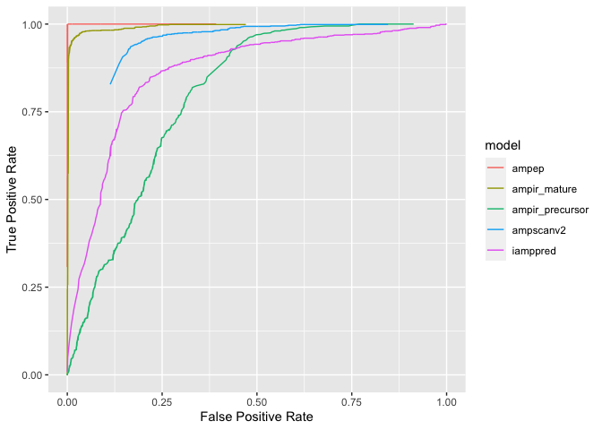
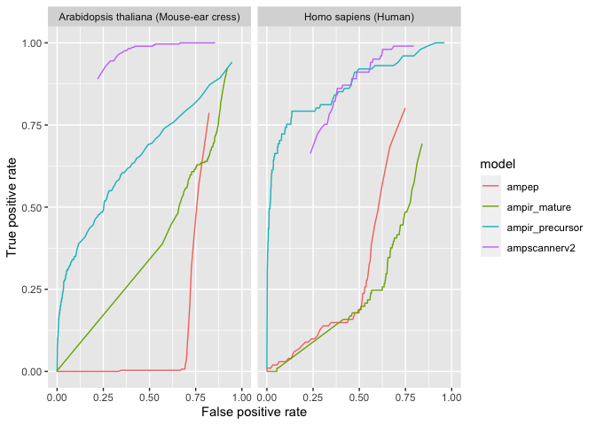
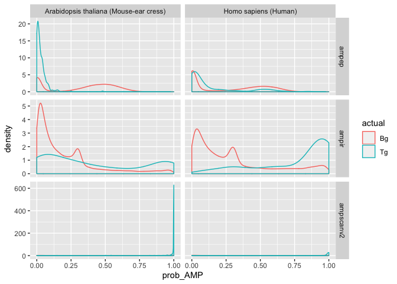

Benchmarking
================

When benchmarking the performance of AMP predictors a number of
important factors need to be considered;

1.  Any benchmark dataset will likely include some AMPs used for
    training in one or more of the predictors. Since most predictors are
    not open source they are provided as-is and it is therefore
    impossible to devise a fair benchmark based on AMPs that were not
    used to train any of the predictors.
2.  An existing benchmark dataset provided by [Xiao et
    al. 2013](https://doi.org/10.1016/j.ab.2013.01.019) has been
    adopted by several subsequent authors but the composition of this
    dataset is better suited to testing predictors of mature peptides
    than genome wide scans (which use precursors as input).
3.  A realistic test of AMP prediction in genome-wide scans should use a
    benchmark dataset that is highly unbalanced, just as a real genome
    protein set would be. For example in the Arabidopsis genome AMPs
    make up less than 1% of proteins.  
4.  Real genomes contain non-AMP proteins that may resemble AMPs in some
    ways (eg secreted proteins, transmembrane proteins) and which will
    therefore make the classification problem more difficult. Any
    benchmark that does not include these proteins will most likely
    provide a inflated estimates of accuracy.

In light of these issues we tested the performance of ampir against
contemporary AMP predictors using two very different benchmark datasets.

1.  The [Xiao et al. 2013](https://doi.org/10.1016/j.ab.2013.01.019)
    benchmark dataset. This was included in the interests of consistency
    with benchmarking from previous work but results from this benchmark
    are not likely to reflect performance in a genome-scanning context
2.  A more realistic but much more challenging benchmark based on
    genomes for species with the best available annotated AMP
    repertoires. We chose an animal (Human) and a plant (Arabidopsis
    thaliana) for this
test.

##### Table 1: AMP predictors with their papers and model accessiblity

| AMP predictor name | Reference                                                           | Availability                                                                          |
| ------------------ | ------------------------------------------------------------------- | ------------------------------------------------------------------------------------- |
| AMP scanner v2     | [Veltri et al. 2018](https://doi.org/10.1093/bioinformatics/bty179) | [amp scanner webserver](https://www.dveltri.com/ascan/v2/ascan.html)                  |
| amPEP              | [Bhadra et al. 2018](https://doi.org/10.1038/s41598-018-19752-w)    | [MATLAB source code](https://sourceforge.net/projects/axpep/files/AmPEP_MATLAB_code/) |
| iAMPpred           | [Meher et al. 2017](https://doi.org/10.1038/srep42362)              | [iAMPpred webserver](http://cabgrid.res.in:8080/amppred/)                             |
| iAMP-2L            | [Xiao et al. 2013](https://doi.org/10.1016/j.ab.2013.01.019)        | [iAMP-2L web server](http://www.jci-bioinfo.cn/iAMP-2L)                               |

\*`iAMP-2L` could not be included in the ROC curve as the model output
is binary only

AMP predictors were accessed in ***April 2020***

### Xiao et al Benchmark

Most predictors performed very well against the Xiao et al benchmark
which is not unexpected given that;

  - The benchmark proteins form a substantial proportion of training
    data for most methods (except ampir\_precursor which performed
    badly)
  - The Xiao benchmark reflects the goals (and hence background data
    choice and other model choices) of all models except
    ampir\_precursor

A notable feature of the ROC curve for this benchmark is that some
predictors (ampscan V2; iamppred) don’t have curves that extend all the
way down to on the X-axis. This is because the probability estimates for
these predictors evntually reach a regime where both true and false
positives have a value equal to 1 and further reductions in FPR can’t be
achieved by increasing stringency of the probability threshold.

<!-- -->

### Real Genome Benchmark

Since we are building a model for the purpose of genome-wide prediction
a realistic test must involve data with composition similar to that of a
whole genome scan.

One approach is to use whole genomes that have been well annotated for
AMPs. Here we chose the Human and Arabidopsis genomes because these
represent phylogenetically distinct lineages (animals and plants) are
their genomes among the best annotated for AMPs. A few other points to
note about this test are;

  - We were able to run this test for `ampir`, `ampep` and `amscan_v2`
    only because other predictors were unable to handle the large number
    of candidates sequences (~100k) in a practical manner.
  - We used a specially generated model for ampir that was trained
    without Human or Arabidopsis proteins to avoid any potential for
    overfitting resulting in inflacted accuracy estimates in this test.
    It should be noted that other predictors would have no such
    restriction.

<!-- -->

We find that Ampep and ampir\_mature both perform very poorly (and
similarly), perhaps because they are both SVMs trained on similar data.
Ampscanner on the other hand appears to perform well within a certain
range (FPR 0.25-0.75) but the important thing for a genome scan is that
it is unable to achieve a FPR less than about 0.25. This is not a good
property for a genome-scanning predictor because 25% of an entire genome
is in the order of 10k false positives. Ampir provides a good balance
and achieves moderate Recall at very low FPR for both organisms. No
predictor was able to achieve high recall at an acceptably low FPR (this
is explored further in the figure below).

While ROC curves and the confusion matrix are useful measures for
benchmarking many classification problems they do not properly capture
the highly imbalanced composition of genome-wide data, where for example
one might be scanning 50-100k proteins and expecting just 100-300 true
positives. In this case it is important to examine the low FPR region of
the ROC curve, and to emphasise precision when doing so. The key outcome
of practical importance here is the proportion of predicted AMPs that
are true positives for a given number of false positives. This is useful
because a common use case when genome scanning is to attempt to identify
a subset of the genome that is strongly enriched in true AMPs, possibly
for the purpose of further experimental validation, or to make broad
inferences about the genomic suite of AMPs for a species.

On this measure it can be seen that genome-wide prediction of AMPs is
still an imperfectly solved problem. Although the ampir precursor model
clearly performs far better than any other predictor, none were able to
predict more than 50% of true AMPs while controlling false positives to
under 500. Nevertheless, given the difficulties in identifying AMPs and
the importance of this task this level of enrichment is of great
practical use, reducing the number of false experimental leads per true
positive from many thousands down to tens or hundreds.

<!-- -->
