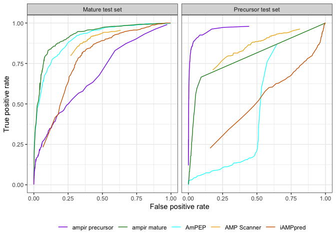
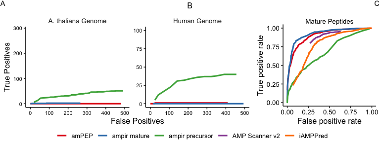

Benchmarking
================

Benchmarking the performance of AMP predictors is challenging for a
number of reasons;

1.  Any benchmark dataset will likely include some AMPs used for
    training in one or more of the predictors. Since most predictors are
    not open source they are provided as-is and it is therefore
    impossible to devise a fair benchmark based on AMPs that were not
    used to train any of the predictors.
2.  An existing benchmark dataset provided by [Xiao et
    al. 2013](https://doi.org/10.1016/j.ab.2013.01.019) has been
    adopted by several subsequent authors but the composition of this
    dataset is better suited to testing predictors of mature peptides
    than genome wide scans (which use precursors as input).
3.  A realistic test of AMP prediction in genome-wide scans should use a
    benchmark dataset that is highly unbalanced, just as a real genome
    protein set would be. For example in the Arabidopsis genome AMPs
    make up less than 1% of proteins and this number certainly not
    likely to be anywhere close to 50% for any species. Real genome
    scans also contain non-AMP proteins that may resemble AMPs in some
    ways (eg secreted proteins, transmembrane proteins) and which will
    therefore make the classification problem more difficult.

In light of these issues we tested the performance of ampir against
contemporary AMP predictors using two very different benchmarks.

1.  The [Xiao et al. 2013](https://doi.org/10.1016/j.ab.2013.01.019)
    benchmark dataset. This was included in the interests of consistency
    with benchmarking from previous work but. Results from this
    benchmark are not likely to reflect performance in a genome-scanning
    context
2.  A more realistic but much more challenging benchmark based on
    genomes for species with the best available annotated AMP
    repertoires. We chose an animal (Human) and plant (Arabidopsis
    thaliana) for this
test.

##### Table 1: AMP predictors with their papers and model accessiblity

| AMP predictor name | Reference                                                           | Availability                                                                          |
| ------------------ | ------------------------------------------------------------------- | ------------------------------------------------------------------------------------- |
| AMP scanner v2     | [Veltri et al. 2018](https://doi.org/10.1093/bioinformatics/bty179) | [amp scanner webserver](https://www.dveltri.com/ascan/v2/ascan.html)                  |
| amPEP              | [Bhadra et al. 2018](https://doi.org/10.1038/s41598-018-19752-w)    | [MATLAB source code](https://sourceforge.net/projects/axpep/files/AmPEP_MATLAB_code/) |
| iAMPpred           | [Meher et al. 2017](https://doi.org/10.1038/srep42362)              | [iAMPpred webserver](http://cabgrid.res.in:8080/amppred/)                             |
| iAMP-2L            | [Xiao et al. 2013](https://doi.org/10.1016/j.ab.2013.01.019)        | [iAMP-2L web server](http://www.jci-bioinfo.cn/iAMP-2L)                               |

\*`iAMP-2L` could not be included in the ROC curve as the model output
is binary only

AMP predictors were accessed in ***April
    2020***

### Xiao et al Benchmark

    ## Warning in output$prob_AMP[predictable_rows] <- p_AMP[, 2]: number of items
    ## to replace is not a multiple of replacement length
    
    ## Warning in output$prob_AMP[predictable_rows] <- p_AMP[, 2]: number of items
    ## to replace is not a multiple of replacement length

<!-- -->

### Real Genome Benchmark

Since we are building a model for the purpose of genome-wide prediction
a realistic test must involve data with composition similar to that of a
whole genome scan.

One approach is to use genomes that have been well annotated for AMPs.
The Human and Arabidopsis are among the best. We were able to run this
test for `ampir`, `ampep` and `amscan_v2` only because other predictors
were unable to handle the large number of candidates sequences (~100k)
in a practical
    manner.

    ## Warning in output$prob_AMP[predictable_rows] <- p_AMP[, 2]: number of items
    ## to replace is not a multiple of replacement length

<!-- -->

Another way to look at performance is with the probability densities of
true and false AMPs. This helps clarify the difference in performance
between models. Ampep performs very poorly because it assigns high
proportions of Tg and Bg proteins a value of p~0.5 and is generally poor
at discriminating. A low FPR can be achieved with this model but only at
the expense of almost all sensitivity. Ampscanner has the opposite
behaviour. It assigns almost all proteins a very high probability which
results in a high TPR but means that it is unable to achieve a FPR less
than about 0.25. This is not a good property for a genome-scanning
predictor because 25% of an entire genome is in the order of 10k false
positives. Ampir provides a good balance. Importantly it allows a low
FPR to be achieved while still maintaining a high TPR.

<!-- -->

While ROC curves and the confusion matrix are useful measures for
benchmarking many classification problems they do not properly capture
the highly imbalanced composition of genome-wide data, where for example
one might be scanning 50-100k proteins and expecting just 100-300 true
positives. In this case it is perhaps more useful to look at the
precision since this represents an outcome of practical importance,
namely the proportion of predicted AMPs that are true positives at a
given p threshold. This is useful because a common use case when genome
scanning is to attempt to identify a subset of the genome that is
strongly enriched in true AMPs, possibly for the purpose of further
experimental validation, or to make broad inferences about the genomic
suite of AMPs for a species.

On this measure it can be seen that genome-wide prediction of AMPs is
still an unsolved problem. Although ampir clearly performs the best,
none of the predictors were able to obtain a prediction set with
precision better than about 15%. Nevertheless, given the difficulties in
identifying AMPs and the importance of this task this level of
enrichment is of great practical use, reducing the number of false
experimental leads per true positive from many thousands down to tens or
hundreds.

    ## Warning: Removed 4 rows containing missing values (geom_path).

<!-- -->
