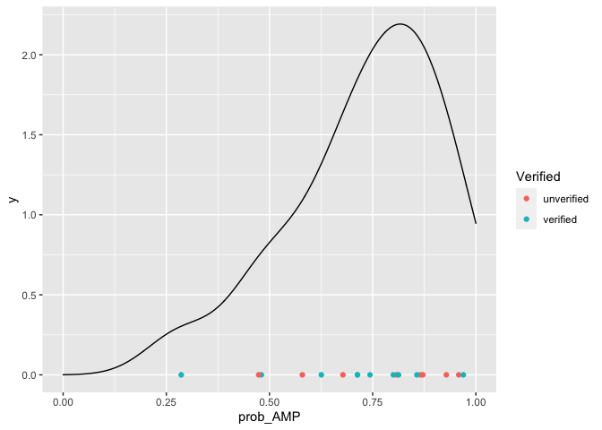

Case Study
================

# Use case for `ampir` as part of an AMP discovery pipeline

Antimicrobial Peptide discovery pipelines typically fall into two major
categories. One approach, is to start with a biological tissue or
secretion with activity against bacteria, perform a fractionation step
and then isolate the active fractions for further fractionation. This
process is continued until a pure fraction is obtained for chemical
analysis. This “bioassay guided fractionation” approach is time
consuming and requires a large amount of starting material. An
alternative, and more recent approach is to start by sequencing the
transcriptome (or genome) of an organism and use in-silico analyses to
identify a relatively small number of candidates. These candidate
sequences are then used to synthesise peptides to allow testing of
antibacterial activity. `ampir` is designed to fit into this latter type
of pipeline as one of the in-silico steps. Recent successful examples
demonstrating the overall principle of this technique include;

  - A study by [Kim et
    al 2016](https://journals.plos.org/plosone/article?id=10.1371/journal.pone.0155304)
    which identified 11 AMPs with strong antibacterial activity in the
    American cockroach.
  - A study by [Yoo et
    al 2014](https://pubmed.ncbi.nlm.nih.gov/24652097/) which identified
    10 novel AMPs in the centipede, *Scolopendra subspinipes mutilans*

Both these studies used a long sequence of in-silico steps to go from
around 70-80k transcripts in the whole transcriptome down to a short
list of around 20 candidate sequences. Key steps include;

1.  Screening based on physicochemical properties
2.  Removal of homologs to known AMPs
3.  Differential expression (eg upregulated in response to bacterial
    challenge).

### Does `ampir` correctly predict verified AMPs in the centipede?

`ampir` comes with two predictive models, one called `mature` is
designed to work with mature peptides whereas another called `precursor`
is designed to work with full length precursor sequences as input.

The study by Yoo et al provides mature peptide sequences for the final
candidate set of 18 peptides which were sent for synthesis. Here we
demonstrate the use of `ampir`’s mature model to predict whether these
peptides are antimicrobial. Since these 18 candidates have already been
subjected to a comprehensive analysis we do not expect that `ampir` will
be able to distinguish between those that passed the final step (assay
of the synthesised product) but we do expect that the majority should be
classified as AMPs by `ampir`.

The mature peptides from Yoo et al are provided in the file
`centipede.xlsx` which we can read in as follows;

``` r
library(tidyverse)

centipede_peps <- readxl::read_excel("raw_data/case_studies/centipede.xlsx")
```

This dataset has the following
information

| ESTID             | PepID    | Seq                                          | Verified   |
| :---------------- | :------- | :------------------------------------------- | :--------- |
| Unigene34794\_All | SmAE\_P1 | KKKHRQFLGIRNYYKEFIPNLSDITSPLHVLLKK           | verified   |
| Unigene45899\_All | SmAE\_P2 | RKLWWRLAAVLTCKSIVKYGHGGERLIEPSSSWFPPKFPSG    | unverified |
| Unigene30751\_All | SmAE\_P3 | QDCPGVRDHLVRGALDLGGVANRTTSRSKYGTKKPKK        | unverified |
| Unigene39330\_All | SmAE\_P4 | GPGETGKKRKRELVSSQLGHLVGRKKISKALSQKISEIWGD    | unverified |
| Unigene22235\_All | SmAE\_P5 | YGGGYGYRRPYYGGYHGGYYRRPYYYGGYYGGGYKYKHWGCRFF | verified   |
| NA                | SmAE\_P6 | YGGGYGYRRPYYGGYHGGYYRRPYYYGGYYGGGYKYKHWGCRFF | verified   |

To run `ampir` we need the `Seq` column as well as a column with unique
names for each sequence (we will use `PepID`). The data can be prepared
for input to `ampir` as follows;

``` r
library(ampir)

# Creates a data.frame where the first column is the ID and the second is the sequence
centipede_ampir_in <- centipede_peps %>% select(PepID,Seq)
```

Now we run predictions using the “mature” model.

``` r
# Run the predictions using the "mature" model
centipede_ampir <- predict_amps(centipede_ampir_in, model = "mature")

head(centipede_ampir) %>% knitr::kable()
```

| PepID    | Seq                                          | prob\_AMP |
| :------- | :------------------------------------------- | --------: |
| SmAE\_P1 | KKKHRQFLGIRNYYKEFIPNLSDITSPLHVLLKK           | 0.2517037 |
| SmAE\_P2 | RKLWWRLAAVLTCKSIVKYGHGGERLIEPSSSWFPPKFPSG    | 0.8095988 |
| SmAE\_P3 | QDCPGVRDHLVRGALDLGGVANRTTSRSKYGTKKPKK        | 0.6712972 |
| SmAE\_P4 | GPGETGKKRKRELVSSQLGHLVGRKKISKALSQKISEIWGD    | 0.9601201 |
| SmAE\_P5 | YGGGYGYRRPYYGGYHGGYYRRPYYYGGYYGGGYKYKHWGCRFF | 0.7109342 |
| SmAE\_P6 | YGGGYGYRRPYYGGYHGGYYRRPYYYGGYYGGGYKYKHWGCRFF | 0.7109342 |

Note that the outputs from ampir include the original columns of the
input data as well as a new column called `prob_AMP` which contains the
probability that the sequence is an AMP.

To look at the overall performance of `ampir` we plot the density of
`prob_AMP` values along the range from 0 to 1. This shows that although
`ampir` correctly predicts almost all peptides are AMPs it is unable to
tell whether these would pass verification or not.

``` r
centipede_verification <- centipede_ampir %>% left_join(centipede_peps)

ggplot(centipede_verification) + geom_density(aes(x=prob_AMP)) + geom_point(aes(y=0,x=prob_AMP,color=Verified)) + xlim(0,1)
```

<!-- -->

### Antimicrobial peptides in Odorous frogs (*Odorrana*)

A more typical use for `ampir` is as an early step in an AMP discovery
pipeline. As an example we consider pipelines for discovery of AMPs from
frogs in the genus *Odorrana*. *Odorrana* is a diverse genus of frogs
native to East Asia. Their skin secretions have proven to be a rich
source of novel antimicrobial peptides, many of which have been
synthesised and assayed to demonstrate activity against bacteria. There
are currently 53 reviewed and 95 unreviewed entries in Uniprot for
*Odorrana* and the keyword “Antimicrobial”.

Discovery of AMPs in *Odorana* exemplifies the potential use case for
ampir. To demonstrate its use we obtained complete transcriptome
sequences for *Odorrana margaretae* from supplementary material provided
in [Qiao et
al 2013](https://journals.plos.org/plosone/article?id=10.1371/journal.pone.0075211).
Unfortunately none of these sequences have confirmed antibacterial
activity (due to lack of testing) but since *Odorrana* is a diverse
genus we were able to identify 10 *O. margaretae* sequences that are
close homologs of AMPs from other *Odorrana* species. Given that there
are at least 100 AMPs in the Human proteome and over 200 in Arabidopsis
this is almost certainly a vast underestimate of the true number of AMPs
in *O. margaretae*. For our purposes it is sufficient to demonstrate the
utility of `ampir` as an early step in an AMP discovery pipeline.

Firstly we identify the set of known AMPs in *O. margaretae* by
importing blast results showing matches between *O. margaretae* and
known *Odorrana*
AMPs.

``` r
blast_colnames <- c('qaccver','saccver','pident','length','mismatch','gapopen','qstart','qend','sstart','send','evalue','bitscore')
omarg_amps_blast <- read_tsv("raw_data/case_studies/o_margaretae_uniprot.blastp", col_names = blast_colnames) %>% 
  group_by(qaccver) %>% top_n(1,bitscore)

omarg_amp_homologs <- omarg_amps_blast$qaccver
omarg_amp_homologs
```

    ##  [1] "odorranaTranscripts_10060_347.p1" "odorranaTranscripts_11116_407.p1"
    ##  [3] "odorranaTranscripts_13513_363.p1" "odorranaTranscripts_13966_372.p1"
    ##  [5] "odorranaTranscripts_27291_286.p1" "odorranaTranscripts_28862_308.p1"
    ##  [7] "odorranaTranscripts_36173_329.p1" "odorranaTranscripts_36173_329.p1"
    ##  [9] "odorranaTranscripts_36742_286.p1" "odorranaTranscripts_37089_292.p1"

Next we use the `read_faa()` function from `ampir` to read the entire
*O. margaretae* transcriptome.

``` r
omarg_aa <- read_faa("raw_data/case_studies/o_margaretae_aa.fasta") 

# Since these are raw outputs from Trinity we also use the following step to clean their sequence names
omarg_aa <-  omarg_aa %>% mutate(seq_name = str_match(seq_name,"^[^\\ ]*")[,1])

head(omarg_aa) %>% knitr::kable()
```

| seq\_name                           | seq\_aa                                                                                                                                                                                                                                                                                                      |
| :---------------------------------- | :----------------------------------------------------------------------------------------------------------------------------------------------------------------------------------------------------------------------------------------------------------------------------------------------------------- |
| odorranaTranscripts\_10000\_515.p1  | MEAEQSTEGGQSQVSENPHSEYGLTDNVERIVENEKASTEKASKQKVDLQALPTRAYLDQTVVPILLQGLSVLAKERPPNPIEFLASYLLKNKAQFEDRS                                                                                                                                                                                                         |
| odorranaTranscripts\_10002\_1290.p1 | MDAPWELAGGLCCTHRGIITDGNNSPGAKLGINFDGNRSLMAWLWRPWLVIGSDVFGQGIVTTRDCSTSPIQPHVIRGMVDRWDLGAREVVVIFGYLAV                                                                                                                                                                                                          |
| odorranaTranscripts\_10003\_792.p2  | MTVNITQLLAPVEVELSAINPSPPILFTIKKPPPPIIPFFRQFCLPVQKC                                                                                                                                                                                                                                                           |
| odorranaTranscripts\_10004\_2529.p1 | MQLIGPGCRLPAGANILKERRQETVHFAKLIFSWLVNKMKLCSLSLPSFYAHDWMSKVNTVSPFH                                                                                                                                                                                                                                            |
| odorranaTranscripts\_10004\_2529.p2 | MQFDPEVARPQPSLCFEVHSHLQIHPYGDYMQEPQWGGVRCPRLAATGSPIESTGRMLAPFS                                                                                                                                                                                                                                               |
| odorranaTranscripts\_10005\_1223.p1 | SSEEVLNLRFPLHRACRDGDLHCLRSLLQGPPGNTAQQLGKEDSCYGWTPIHWAAHFGKLECLVQLVGAGCSVNASTTRFAQTPAHIAAFGGHPHCLMWLIQAGANVNKQDYVGETPVHKAARAGSLDCLKALVSNGGQIDFKNASGLTAADLAHSQGFTECAQFLLNLQNSQLNGFYCTNSLNGVPQNASSHLNGGINHRKRSFHDLEASVVKKLRTEMNSFGTEYMTGRLEEDDSMHVENHSDISGGIGQFSDRCCNIPMIEDLKPQESTSNRPTDANNFTVSATQTPFRCISQYAYF |

Now we use the `predict_amps()` function in `ampir` to predict AMPs.
Since these are full length proteins we use the “precursor” model and
since there are a large number of sequences we set `n_cores` to the
number of cores on our desktop machine. This step takes around 20
seconds on a 2018 Mac Mini.

``` r
omarg_aa_ampir <- predict_amps(omarg_aa,n_cores=6, model = "precursor")
```

Finally we plot the distribution of `prob_AMP` scores for the whole
transcriptome and for AMP homologs. This plot suggests that by using
`ampir` as an initial pipeline step with a cut-off (`prob_AMP`\>0.5) the
search space for AMPs can be reduced from around 77000 to just 5000.
With so few verified AMPs for this organism it is difficult to determine
whether a higher cut-off (eg prob\_AMP\>0.9) could be used to provide
greater specificity.

``` r
omarg_aa_ampir_plot <- omarg_aa_ampir %>% 
  mutate(amp = ifelse(seq_name %in% omarg_amp_homologs,"AMP Homolog","Non-AMP")) %>% 
  add_count(amp)


ggplot(omarg_aa_ampir_plot,aes(x=amp,y=prob_AMP)) + 
  geom_violin(aes(color=amp)) + xlab("")
```

<!-- -->
